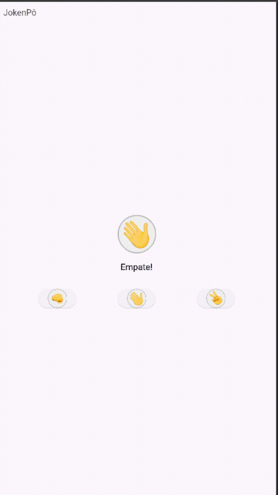

✂️ Jokenpo App
Este é um aplicativo Flutter desenvolvido em Dart, que simula o clássico jogo do Jokenpo (Pedra, Papel e Tesoura).
O usuário escolhe sua jogada, o app gera uma jogada aleatória para o oponente e exibe o resultado na tela!
---

##📌 Funcionalidades
✅ Escolher entre Pedra, Papel ou Tesoura
✅ Jogada aleatória gerada para o "oponente"
✅ Exibição do resultado ("Vitória", "Derrota" ou "Empate")
✅ Interface amigável e responsiva


## 🚀 Como instalar e rodar o projeto

### 1️⃣ Clonar o repositório
```bash
git clone https://github.com/Rodrigoscast/Jokenpo.git
cd jokenpo
```

### 2️⃣ Instalar dependências
```bash
flutter pub get
```

### 3️⃣ Rodar o projeto
```bash
flutter run
```

### 🛠️ Tecnologias utilizadas
Flutter 🐦
Dart 🎯

### 🎨 Gif do projeto final



